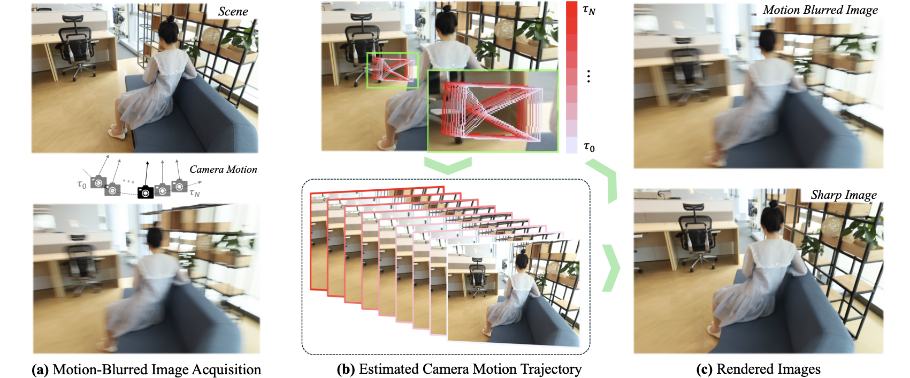

<p align="center">
<h1 align="center">
  CoMoGaussian: Continuous Motion-Aware
  <br />Gaussian Splatting from Motion-Blurred Images
  <br />
</h1>
<h3 align="center">ICCV 2025</h3>
  <p align="center">
    <a href="https://Jho-Yonsei.github.io/">Jungho Lee </a><sup>1</sup>&nbsp;·&nbsp;
    Donghyeong Kim <sup>1</sup>&nbsp;·&nbsp;
    <a href="https://dogyoonlee.github.io/">Dogyoon Lee</a> <sup>1</sup>&nbsp;·&nbsp;
    <a href="https://suhwan-cho.github.io">Suhwan Cho </a><sup>1</sup>&nbsp;·&nbsp;
    <a href="https://hydragon.co.kr">Minhyeok Lee</a> <sup>1</sup>&nbsp;&nbsp;<br>
    Wonjoon Lee <sup>1</sup>&nbsp;&nbsp;
    <a href="https://taeoh-kim.github.io">Taeoh Kim </a><sup>2</sup>&nbsp;·&nbsp;
    Dongyoon Wee <sup>2</sup>&nbsp;·&nbsp;
    <a href="http://mvp.yonsei.ac.kr/">Sangyoun Lee</a> <sup>1</sup>&nbsp;&nbsp;
  </p>
  <p align="center">
    <sup>1</sup> Yonsei University&nbsp;&nbsp;&nbsp;&nbsp;<sup>2</sup> NAVER Cloud
  </p>
  <p align="center">
    <a href="https://Jho-Yonsei.github.io/CoMoGaussian"></a>
    <a href="https://arxiv.org/abs/2503.05332"></a>
    <a href="https://drive.google.com/file/d/1htDfHqG_i0zMIzk3xBf07B7nDB4VYgSj/view?usp=drive_link"></a>
  </p>
  <div align="center"></div>
</p>
</p>

## 🔭 Introduction

<p align="center">
  
</p>

|  |  |  |
|:--:|:--:|:--:|
| Input Blurry Images | 3D Gaussian Splatting | **CoMoGaussian (Ours)** |

<p align="center">
  More results are provided in the  
  <a href="https://Jho-Yonsei.github.io/CoMoGaussian/" target="_blank">Project Page</a>.
</p>


<!-- <table style="width:100%;">
  <tr>
    <td colspan="3" style="text-align:center; vertical-align:middle;">
      
    </td>
  </tr>
  <tr>
    <td style="text-align:center; vertical-align:middle;">
      
    </td>
    <td style="text-align:center; vertical-align:middle;">
      
    </td>
    <td style="text-align:center; vertical-align:middle;">
      
    </td>
  </tr>
  <tr>
    <td style="text-align:center;">Input Blurry Images</td>
    <td style="text-align:center;">3D Gaussian Splatting</td>
    <td style="text-align:center;"><strong>CoMoGaussian (Ours)</strong></td>
  </tr>
  <tr>
    <td colspan="3" style="text-align:center;">
      More results are provided in the 
      <a href="https://Jho-Yonsei.github.io/CoMoGaussian/" target="_blank">Project Page</a>.
    </td>
  </tr>
</table> -->

<p align="justify">
  <strong>Abstract:</strong> 3D Gaussian Splatting (3DGS) has gained significant attention due to its high-quality novel view rendering, motivating research to address real-world challenges. 
A critical issue is the camera motion blur caused by movement during exposure, which hinders accurate 3D scene reconstruction. 
In this study, we propose CoMoGaussian, a Continuous Motion-Aware Gaussian Splatting that reconstructs precise 3D scenes from motion-blurred images while maintaining real-time rendering speed. 
Considering the complex motion patterns inherent in real-world camera movements, we predict continuous camera trajectories using neural ordinary differential equations (ODEs). 
To ensure accurate modeling, we employ rigid body transformations, preserving the shape and size of the object but rely on the discrete integration of sampled frames. 
To better approximate the continuous nature of motion blur, we introduce a continuous motion refinement (CMR) transformation that refines rigid transformations by incorporating additional learnable parameters.
By revisiting fundamental camera theory and leveraging advanced neural ODE techniques, we achieve precise modeling of continuous camera trajectories, leading to improved reconstruction accuracy. 
Extensive experiments demonstrate state-of-the-art performance both quantitatively and qualitatively on benchmark datasets, which include a wide range of motion blur scenarios, from moderate to extreme blur.
</p>

## 🆕 News
- 2025-07-15: Code, [[project page]](https://Jho-Yonsei.github.io/CoMoGaussian/), and [[arXiv paper]](https://arxiv.org/abs/2503.05332) are available.
- 2025-06-26: CoMoGaussian got accepted by ICCV 2025!

## 🔧 Installation
Clone the repository and create an anaconda environment using.

```
git clone https://github.com/Jho-Yonsei/CoMoGaussian.git
cd CoMoGaussian

conda create -y -n comogaussian python=3.10
conda activate comogaussian

pip install torch==2.3.0 torchvision==0.18.0 torchaudio==2.3.0 --index-url https://download.pytorch.org/whl/cu121
pip install -r requirements.txt

pip install -e ./submodules/diff-gaussian-rasterization-pose-backprob/
pip install -e ./submodules/simple-knn/
```

Please note that the ```diff-gaussian-rasterization-pose-backprop``` we provide is not completely same with the original [3D Gaussian Splatting](https://github.com/graphdeco-inria/gaussian-splatting), as our CRiM kernel optimization requires gradient computation of camera poses. We referred [iComMa](https://github.com/YuanSun-XJTU/iComMa) repository and revised some parts of the cuda-coded backward computation of rasterization.

## 📦 Datasets
You can find the datasets with the SfM results on [Our Google Drive](https://drive.google.com/file/d/1htDfHqG_i0zMIzk3xBf07B7nDB4VYgSj/view?usp=drive_link). The ```real_camera_motion_blur``` ([Deblur-NeRF](https://github.com/limacv/Deblur-NeRF)), ```synthetic_camera_motion_blur``` ([Deblur-NeRF](https://github.com/limacv/Deblur-NeRF)), and ```exblurf_camera_motion_blur``` ([ExbluRF](https://github.com/taekkii/exblurf)) directories should be placed in the subdirectory of ```CoMoGaussian/dataset/```.

## 🚅 Training
To train the CoMoGaussian, run
```
CUDA_VISIBLE_DEVICES=<GPU> python train.py -s <path to dataset> -m <path to save the model> --eval -r <resolution ratio>
```
Note that the resolution ratio for ```real_camera_motion_blur``` is ```4```, and those of ```synthetic_camera_motion_blur``` and ```exblurf_camera_motion_blur``` are ```1```.

<strong>Examples</strong>
```
# Deblur-NeRF Synthetic Dataset
CUDA_VISIBLE_DEVICES=0 python train.py -s ./dataset/synthetic_camera_motion_blur/blurfactory -m ./output/synthetic_camera_motion_blur/factory --eval -r 1

# Deblur-NeRF Real-World Dataset
CUDA_VISIBLE_DEVICES=0 python train.py -s ./dataset/real_camera_motion_blur/blurball -m ./output/real_camera_motion_blur/ball --eval -r 4

# ExbluRF Real-World Dataset
CUDA_VISIBLE_DEVICES=0 python train.py -s ./dataset/exblurf_camera_motion_blur/blurball -m ./output/exblurf_camera_motion_blur/bench --eval -r 1
```

## 🔦 Rendering
To render the output images, run
```
CUDA_VISIBLE_DEVICES=<GPU> python render.py -m <model saving path>
```

<details>
<summary><span style="font-weight: bold;">Command Line Arguments for render.py</span></summary>

#### --skip_train
Flag to skip rendering the training set.

#### --skip_test
Flag to skip rendering the test set.

#### --skip_video
Flag to skip rendering the output video.

#### --pose_optimize
Add ```--pose_optimize False``` if you do not want further optimization of test camera poses. If you add this command line, you will get the performances of the paper.

</details>

## 🔦 Evaluation
To evaluate the rendered output, run
```
CUDA_VISIBLE_DEVICES=<GPU> python metrics.py -m <model saving path> -r <resolution ratio>
```

## 🔦 Online Viewer
If you want to render the trained model in online, use the online viewer of [Mip-Splatting](https://niujinshuchong.github.io/mip-splatting-demo). After run the following command, put the generated ```.ply``` file on the online viewer page.

```
python3 create_fused_ply.py -m <model saving path> --output_ply <ply saving path>
```

## 🌟 Acknowledgements
Our repository is built upon [Mip-Splatting](https://github.com/autonomousvision/mip-splatting) and [3D Gaussian Splatting](https://github.com/graphdeco-inria/gaussian-splatting). The gradient computation of camera poses and pixel-wise weight are influenced by [iComMa](https://github.com/YuanSun-XJTU/iComMa) and [BAGS](https://github.com/snldmt/BAGS), respectively. We thank to all the authors for their awesome works.

## BibTex
```
@article{lee2025comogaussian,
  title={CoMoGaussian: Continuous Motion-Aware Gaussian Splatting from Motion-Blurred Images},
  author={Lee, Jungho and Kim, Donghyeong and Lee, Dogyoon and Cho, Suhwan and Lee, Minhyeok and Lee, Wonjoon and Kim, Taeoh and Wee, Dongyoon and Lee, Sangyoun},
  journal={arXiv preprint arXiv:2503.05332},
  year={2025}
}
```